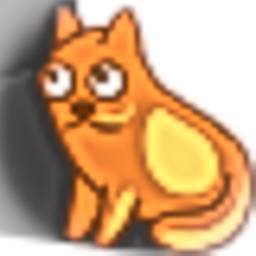
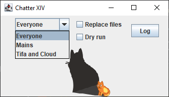

#  Chatter14


Provides a way to extract Final Fantasy XIV chat conversations from an Advanced Combat
Tracker (ACT) log.

## Contents

- [Introduction](#introduction)
- [Usage](#usage)
    - [Window](#window)
    - [Command Line](#command)
    - [Configuration File](#configuration)
- [Installation](#installation)
    - [Windows](#installation-windows)
    - [Linux, MacOS](#installation-linux)
- [Developing](#developing)
- [Acknowlegements and Licenses](#installation-acknowledgement)

## <a name="introduction">Introduction</a>

ACT is often used to view information about combat but it also extracts
all of the chat logs as well. However these chat logs are interspersed with all kinds of
other information about actions happening in the environment around your character. This
makes reading a conversation nearly impossible. And if there are multiple separate
conversations at the same time these conversations are interspersed.

This app will extract chats from the ACT logs and will further strip out all but a single
group of people that you define. It can also, optionally include all of the emotes that
were used between the members of the group as many conversations occur almost entirely
through emotes.

The current version treats all chat types (say, yell, linkshell, etc.) the same and
outputs them all. A future version will let you select which chat types to include in
a particular conversation. I personal have noted that people are not consistent in the
use of chat types even for a single conversation, switching between a linkshell, say, and
even yell.

## <a name="usage">Usage</a>

Chatter14 can be run from the command line or as a window that accepts drag-and-drop.

### <a name="window">Window</a>

Starting Chatter14 with no arguments or clicking on the icon will start Chatter14 in
windowed mode.


To convert one or more ACT log files drag them to the Chatter14 window. The background
image will change to show that they can be dropped. They will be converted using the
current options in the window. The generated files will be .txt files in the same
directory as the logs, with the a name in the form {original_name}-{group_short_name}.txt.
It will include all of the lines from the log that match the group definition and
optionally the emotes.

#### Options

The dropdown selects the group of people to filter for. These are defined in the
[configuration file](#configuration).



The **Emotes** checkbox selects whether the emote entries for the group are included in
the output file. Many "conversations" in **FFXIV** are carried out in a combination of
chat
and emotes.

The **Replace files** checkbox determines whether any existing generated files will be
replaced. If this is not checked, any existing files will be skipped.

If the **Dry run** checkbox is checked then `Chatter14` will do everything except write
out the output files. Mostly useful for testing the program.

The **Log** button will bring a window that shows the execution log. Mostly useful for
testing but it also helps to show progress.

### <a name="command">Command Line</a>

The command line mode processes the files given on the command line just as if they were
dropped onto the window. The options are the same as the window mode with two additions.
The first is the `-c/--config` option which will log the parsed configuration file. This
makes it easier to see what was actually read from the configuration file. The second is
the `-w/--window` option (the default) which tells the program to run in windows mode. To
run as a command line instead the `-W/--no-window` option is used.

Here is what is displayed by the `-h` help option. Note that it also displays the groups
that were read from the configuration file.

```
Usage: chatter14 [OPTIONS] [FILES]...

  Extracts FFXIV chat and emote lines from ACT logs.

  This application takes one or more ACT log files and extracts various chat
  and optionally emote lines from the log. The lines can be further filtered
  by a list of user names.

  This command can be run in either command line or windowed modes. Command
  line mode is useful for experience users or inclusion in scripts. Windowed
  mode allows for drag-and-drop actions to convert files. The default is to
  use windowed mode.

Options:
  --version                        Show the version and exit
  -c, --config                     logs the config
  -d, --dryrun / -P, --process     process without creating output files
  -r, --replace / -S, --no-replace
                                   replace existing text files
  -e, --emotes / -E, --no-emotes   include emotes in the output
  -w, --window / -W, --no-window   display drag-and-drop target window
  -g, --group [everyone|mains|tifa]
                                   group (list of users) to filter for
  -h, --help                       Show this message and exit

Arguments:
  FILES  The log files to process

Configured groups:

  Everyone (everyone)

  Mains (mains)
    Bobcat Goldthwait
    Cecil Harvey
    Cloud Strife
    Tifa Lockhart

  Tifa and Cloud (tifa)
    Cloud Strife
    Tifa Lockhart
```

### <a name="configuration">Configuration File</a>

There is a special group that is always present
called `Everyone` that selects all conversations from every person in the log. Thi

The configuration file is written in a format called [TOML](https://toml.io/en/) but if
you just copy the sample and make the appropriate adjustments you don't really need to
know the details.

The file starts with the default option selections and then is followed by the renames
and then the group definitions. The options are the same as the command line and window
options with two additions.

#### Options

| Option Name     | Description                                                                                                                                                           |
|-----------------|-----------------------------------------------------------------------------------------------------------------------------------------------------------------------|
| dryRun          | If true then all processing occurs except the output file is not written. Default is `false`.                                                                         |
| replaceIfExists | If true then any existing target TXT files will be replaced, otherwise no output file is writter. Default is `false`.                                                 |
| includeEmotes   | If true then emote lines generated byt the people in the group are included in the output. Default is `true`.                                                         |
| performRename   | If true then the person renames are applied to any line that is written ot the output. This can make lines shorter for those people you know well. Default is `true`. |
| dataCenter      | The name of your data center. This must be one of the valid data centers existing at the time this application was built. Default to `Crystal`.                       |
| server          | The name of your server. This must be one of the valid servers in the given data center exsting at the time this application was built. Default to `Zalera`.          |

#### Renames

The next section defines the character renames. This is just a list of match the name on
the left and replace it with the name of the right. The names do not have to have any
relation to each other but don't have one name renamed to another that is in the list or
the application may fail. The name must be surrounded by quotes.

#### Groups

The remaining sections define the groups. A group is a list of character full names that
will be included in the output generated when that group is selected. You should probably
include your own name in each group but that is not required.

There is always a group called Everyone (everyone) that when selected includes all
characters from all conversations. This can be a large amount of output and really should
probably only be used when you're trying to find and conversation with someone new that
you don't have the name of.

The label of the group is used in the window drop-down to select the group.

The shortname is what is used to select the group from the command line.

The paritcipants is a list of all of the characters to include in the group. Each entry
is the full name of the character not including the world. The current version of
`chatter14` does not support characters with the same name from different worlds.

#### Sample configuration

Here is a sample confguration that demonstrates every option.

```toml
dryRun = false
replaceIfExists = false
includeEmotes = true
performRename = true
dataCenter = "Crystal"
server = "Zalera"

[renames]
"Bobcat Goldthwait" = "Bobby"
"Tifa Lockhart" = "Tifa"
"Cecil Harvey" = "Cecil"
"Cloud Strife" = "Cloudy"

[[group]]
label = "Tifa and Cloud"
shortname = "tifa"
participants = [
    "Tifa Lockhart",
    "Cloud Strife",
]

[[group]]
label = "Mains"
shortname = "mains"
participants = [
    "Bobcat Goldthwait",
    "Tifa Lockhart",
    "Cecil Harvey",
    "Cloud Strife",
]
```

## <a name="installation">Installation</a>

### <a name="installation-windows">Windows</a>

The Windows version is pacakged as an installer, just run the installer and it should
install everything needed. This product requires Java to run and it should install the
required files automatically but if it cannot it will prompt you to install the Java
runtime.

### <a name="installation-linux">Linux, MacOS</a>

Extract the tar file into an appropriate place and add the `chatter14` script to the
PATH.

## <a name="developing">Developing</a>

TBD.

### Build Windows icon

The icon is generated from and JPG using the ImageMagick tool.

```command
magick src\main\resources\images\chatter14.jpg -background none -extent 256x256 -define icon:auto-resize="256,128,96,64,48,32,16" src\main\installer\chatter14.ico
```

## <a name="installation-acknowledgement">Acknowlegements and Licenses</a>

Licenses are listed here [Licenses](LICENSES.md).

